# 学习与作业收集平台使用规范

<div align="center">


**📚 一站式学习平台，掌握现代开发必备技能**

</div>

> 💡 学习中任何过程可以联系管理员交流

## 📋 目录导航

- [📝 Markdown 语法学习指南](#0-markdown-语法学习指南)
- [🔧 开发环境配置](#1-开发环境配置)
- [📖 学习资源](#2-学习资源)
- [🌿 Git 使用详细指南](#3-git-使用详细指南)
- [🐙 GitHub 使用详细指南](#4-github-使用详细指南)
- [🚀 PR 提交流程](#5-pr-提交流程)
- [⚠️ 注意事项](#6-注意事项)

## 🎯 学习目标

本仓库用于集中提交与管理各方向课程/练习作业。请认真阅读对应要求和说明规范。

**在这里你将学习到：**

- 🔧 **Git 基本操作** - 掌握版本控制的核心技能
- 📝 **Markdown 语法** - 学会编写优雅的技术文档
- 🤝 **GitHub 协作流程** - 参与开源项目的标准流程
- 📚 **技术文档规范** - 提升技术写作能力

---

## 0. Markdown 语法学习指南

<details>
<summary><strong>📝 基础语法</strong></summary>

### 标题
```markdown
# 一级标题
## 二级标题
### 三级标题
#### 四级标题
##### 五级标题
###### 六级标题
```

### 文本格式
```markdown
**粗体文本**
*斜体文本*
***粗斜体文本***
~~删除线~~
`行内代码`
```

### 列表
```markdown
# 无序列表
- 项目1
- 项目2
  - 子项目2.1
  - 子项目2.2

# 有序列表
1. 第一项
2. 第二项
   1. 子项目2.1
   2. 子项目2.2

# 任务列表
- [x] 已完成任务
- [ ] 未完成任务
```

### 链接和图片
```markdown
# 链接
[链接文本](https://example.com)
[带标题的链接](https://example.com "链接标题")

# 图片


# 引用式链接
[链接文本][1]
[1]: https://example.com "链接标题"
```

### 引用
```markdown
> 这是一个引用
> 
> 可以有多行
> 
> > 嵌套引用
```

</details>

<details>
<summary><strong>🚀 高级语法</strong></summary>

### 代码块
```markdown
# 行内代码
使用 `console.log()` 输出信息

# 代码块（指定语言高亮）
```python
def hello_world():
    print("Hello, World!")
```

```javascript
function helloWorld() {
    console.log("Hello, World!");
}
```

```bash
git clone https://github.com/user/repo.git
cd repo
```
```

### 表格
```markdown
| 列1 | 列2 | 列3 |
|-----|-----|-----|
| 内容1 | 内容2 | 内容3 |
| 内容4 | 内容5 | 内容6 |

# 对齐方式
| 左对齐 | 居中对齐 | 右对齐 |
|:-------|:-------:|-------:|
| 内容   |   内容   |   内容 |
```

### 分割线
```markdown
---
***
___
```

### 转义字符
```markdown
\* 不会变成斜体
\# 不会变成标题
\` 不会变成代码
```

</details>

<details>
<summary><strong>🐙 GitHub 扩展语法</strong></summary>

### 语法高亮
```markdown
```diff
+ 添加的行
- 删除的行
  普通行
```

```json
{
  "name": "example",
  "version": "1.0.0"
}
```
```

### 表情符号
```markdown
:smile: :heart: :thumbsup: :fire: :rocket:
```

### 提及和引用
```markdown
@username 提及用户
#123 引用 Issue 或 PR
```

### 折叠内容
```markdown
<details>
<summary>点击展开详细内容</summary>

这里是折叠的内容，可以包含：
- 列表
- 代码块
- 其他 Markdown 内容

</details>
```

</details>

<details>
<summary><strong>💡 实用技巧</strong></summary>

### 目录生成
```markdown
# 目录
- [章节1](#章节1)
- [章节2](#章节2)
  - [子章节2.1](#子章节21)

## 章节1
内容...

## 章节2
内容...

### 子章节2.1
内容...
```

### 数学公式（GitHub 支持）
```markdown
# 行内公式
这是一个行内公式：$E = mc^2$

# 块级公式
$$
\sum_{i=1}^{n} x_i = x_1 + x_2 + \cdots + x_n
$$
```

### 脚注
```markdown
这是一个带脚注的文本[^1]。

[^1]: 这是脚注的内容。
```

### 键盘按键
```markdown
按 <kbd>Ctrl</kbd> + <kbd>C</kbd> 复制
按 <kbd>Ctrl</kbd> + <kbd>V</kbd> 粘贴
```

### HTML 标签（部分支持）
```markdown
<mark>高亮文本</mark>
<sub>下标</sub>
<sup>上标</sup>

<details>
<summary>折叠标题</summary>
折叠内容
</details>
```

</details>

<details>
<summary><strong>✨ 最佳实践</strong></summary>

1. **文档结构**：使用清晰的标题层次结构
2. **代码规范**：为代码块指定正确的语言标识符
3. **链接管理**：使用引用式链接管理长链接
4. **图片优化**：提供有意义的替代文本
5. **表格设计**：保持表格简洁，避免过宽
6. **一致性**：在整个文档中保持格式一致

</details>

<details>
<summary><strong>🛠️ 常用工具推荐</strong></summary>

- **编辑器**：Typora, Mark Text, VS Code (Markdown Preview Enhanced)
- **在线编辑**：GitHub, GitLab, Notion
- **格式检查**：markdownlint
- **转换工具**：Pandoc

</details>

---

## 1. 项目结构说明
- 根目录按不同专业方向划分文件夹：当前已有 `Cry/`、`Misc/`、`Pwn/`、`Re/`、`Web/`。
- 每个方向下设独立的作业提交目录，统一命名为 `submissions/`。
- 目录结构如下：大家需要把自己内容交到对应的submissions目录下。

```
learning/
├── Cry/
│   └── submissions/
├── Misc/
│   └── submissions/
├── Pwn/
│   └── submissions/
├── Re/
│   └── submissions/
├── Web/
│   └── submissions/
└── README.md
```

---

## 2. 作业提交规范
- 提交格式：仅支持 Markdown（`.md` 文件）。
- 文件命名：`ID.md`（ID 为个人ID）。
- 提交位置：对应方向目录下的 `submissions/` 目录，例如 `Web/submissions/bpple.md`。
- 内容要求（建议包含以下模块）：
  - 标题与作业名称
  - 简介/题目说明
  - 环境与依赖（版本、平台）
  - 解题思路/步骤说明
  - 关键代码片段（使用三引号并注明语言，如 ` ```python`、` ```c` 等）
  - 结果与总结
  - 参考文章

示例模板（大家参考就好，可以根据自己的情况修改，但是一定要具有格式化的Markdown语法）：

```
# Writeup 标题
- ID:your_id
- 方向：Cry / Misc / Pwn / Re / Web
- 日期：YYYY-MM-DD
- 平台/来源：CTFd / HackTheBox / AttackDefense / 其他
- 题目名称：Example Challenge
- 分类与分值：Web / 200 pts（难度：Medium）
- 题目链接/附件：<题目链接或附件说明>

## 目标与范围
- 靶机/远程地址：<host:port 或 docker>
- 漏洞类型：例如 SQLi / XSS / BOF / 逻辑漏洞
- 约束与规则：仅在授权范围内操作，避免影响真实生产环境

## 环境与依赖
- 操作系统：Windows / Linux / macOS
- 工具与版本：pwntools 4.x / nmap 7.x / BurpSuite / Ghidra / sqlmap / IDA Free 等
- 语言与版本：Python 3.10 / GCC 12 / Node.js 20
- 复现实验：提供启动/连接方式（如 docker、nc、ssh、HTTP）

## 解题过程
1. 信息收集与初步分析
2. 漏洞定位与可利用性验证
3. 构造 Payload / Exploit 步骤
4. 拿到 Flag 的过程（如需，flag 内容可脱敏为 `flag{redacted}`）
5. 常见坑与绕过技巧

## 关键代码
```python
# Pwn 示例：使用 pwntools 连接并构造溢出
from pwn import *
context.log_level = 'info'
# r = process('./vuln')  # 本地调试
# 或远程：
# r = remote('challenge.host', 31337)
payload = b'A' *  cyclic_find(b'aaaa') + p64(0xdeadbeef)
# r.sendline(payload)
# r.interactive()
```

```http
# Web 示例：SQL 注入基础请求（仅在授权范围）
GET /item?id=1' OR '1'='1 HTTP/1.1
Host: challenge.host
```

## 结果与总结
- 复现证据：关键日志、请求/响应片段、截图（必要时脱敏）
- 根因分析：为何存在漏洞、触发条件
- 修复建议：输入校验/权限控制/内存安全等

## 参考
- 官方/社区 Writeup 链接
- 相关技术文档与工具手册
```

---

## 3. Git 使用详细指南

<details>
<summary><strong>📚 Git 基础概念</strong></summary>

### 什么是 Git？
Git 是一个分布式版本控制系统，用于跟踪文件的变化并协调多人协作开发。

### 核心概念
- **仓库（Repository）**：存储项目文件和版本历史的地方
- **工作区（Working Directory）**：当前正在编辑的文件
- **暂存区（Staging Area）**：准备提交的文件区域
- **提交（Commit）**：保存的项目快照
- **分支（Branch）**：独立的开发线
- **远程仓库（Remote）**：托管在网络上的仓库

</details>

<details>
<summary><strong>⚙️ Git 安装与配置</strong></summary>

### 安装 Git
```bash
# Windows (使用 Git for Windows)
# 下载：https://git-scm.com/download/win

# macOS (使用 Homebrew)
brew install git

# Ubuntu/Debian
sudo apt update
sudo apt install git

# CentOS/RHEL
sudo yum install git
```

### 初始配置
```bash
# 设置用户名和邮箱（全局配置）
git config --global user.name "你的姓名"
git config --global user.email "your.email@example.com"

# 设置默认编辑器
git config --global core.editor "code --wait"  # VS Code
git config --global core.editor "vim"          # Vim

# 设置默认分支名
git config --global init.defaultBranch main

# 查看配置
git config --list
git config --global --list
```

</details>

<details>
<summary><strong>🚀 基础操作</strong></summary>

### 创建和克隆仓库
```bash
# 初始化新仓库
git init
git init my-project

# 克隆远程仓库
git clone https://github.com/user/repo.git
git clone https://github.com/user/repo.git my-folder

# 克隆特定分支
git clone -b branch-name https://github.com/user/repo.git
```

### 文件操作
```bash
# 查看状态
git status
git status -s  # 简短格式

# 添加文件到暂存区
git add file.txt           # 添加单个文件
git add *.js              # 添加所有 .js 文件
git add .                 # 添加所有文件
git add -A                # 添加所有文件（包括删除的）

# 提交更改
git commit -m "提交信息"
git commit -am "添加并提交"  # 跳过暂存区（仅对已跟踪文件）

# 查看提交历史
git log
git log --oneline         # 简洁格式
git log --graph           # 图形化显示
git log --author="作者名"  # 按作者筛选
git log --since="2023-01-01" --until="2023-12-31"  # 按时间筛选
```

### 撤销操作
```bash
# 撤销工作区修改
git checkout -- file.txt
git restore file.txt      # Git 2.23+

# 撤销暂存区文件
git reset HEAD file.txt
git restore --staged file.txt  # Git 2.23+

# 撤销最后一次提交（保留修改）
git reset --soft HEAD~1

# 撤销最后一次提交（丢弃修改）
git reset --hard HEAD~1

# 修改最后一次提交
git commit --amend -m "新的提交信息"
```

</details>

<details>
<summary><strong>🌿 分支管理</strong></summary>

### 分支基础操作
```bash
# 查看分支
git branch              # 本地分支
git branch -r           # 远程分支
git branch -a           # 所有分支

# 创建分支
git branch feature-branch
git checkout -b feature-branch    # 创建并切换
git switch -c feature-branch      # Git 2.23+

# 切换分支
git checkout main
git switch main         # Git 2.23+

# 删除分支
git branch -d feature-branch      # 安全删除
git branch -D feature-branch      # 强制删除
```

### 分支合并
```bash
# 合并分支（Fast-forward）
git checkout main
git merge feature-branch

# 合并分支（创建合并提交）
git merge --no-ff feature-branch

# 变基合并（保持线性历史）
git checkout feature-branch
git rebase main
git checkout main
git merge feature-branch
```

</details>

<details>
<summary><strong>🌐 远程仓库操作</strong></summary>

### 远程仓库管理
```bash
# 查看远程仓库
git remote -v

# 添加远程仓库
git remote add origin https://github.com/user/repo.git
git remote add upstream https://github.com/original/repo.git

# 修改远程仓库 URL
git remote set-url origin https://github.com/user/new-repo.git

# 删除远程仓库
git remote remove origin
```

### 推送和拉取
```bash
# 推送到远程仓库
git push origin main
git push -u origin main  # 设置上游分支
git push --all           # 推送所有分支
git push --tags          # 推送标签

# 从远程仓库拉取
git pull origin main     # 拉取并合并
git fetch origin         # 仅拉取，不合并
git pull --rebase origin main  # 拉取并变基

# 强制推送（谨慎使用）
git push --force-with-lease origin main
```

</details>

<details>
<summary><strong>⚔️ 冲突解决</strong></summary>

### 识别冲突
```bash
# 当合并或拉取时出现冲突
git status  # 查看冲突文件
```

### 解决冲突
```bash
# 1. 编辑冲突文件，解决冲突标记
# <<<<<<< HEAD
# 当前分支的内容
# =======
# 其他分支的内容
# >>>>>>> branch-name

# 2. 添加解决后的文件
git add conflicted-file.txt

# 3. 完成合并
git commit  # 如果是合并冲突
git rebase --continue  # 如果是变基冲突

# 取消合并或变基
git merge --abort
git rebase --abort
```

</details>

<details>
<summary><strong>🔧 高级操作</strong></summary>

### 标签管理
```bash
# 创建标签
git tag v1.0.0
git tag -a v1.0.0 -m "版本 1.0.0"  # 带注释的标签

# 查看标签
git tag
git show v1.0.0

# 推送标签
git push origin v1.0.0
git push origin --tags

# 删除标签
git tag -d v1.0.0              # 本地删除
git push origin --delete v1.0.0  # 远程删除
```

### 储藏（Stash）
```bash
# 储藏当前修改
git stash
git stash save "储藏信息"

# 查看储藏列表
git stash list

# 应用储藏
git stash apply           # 应用最新储藏
git stash apply stash@{1} # 应用指定储藏
git stash pop             # 应用并删除最新储藏

# 删除储藏
git stash drop stash@{1}
git stash clear           # 清空所有储藏
```

### 子模块
```bash
# 添加子模块
git submodule add https://github.com/user/repo.git path/to/submodule

# 初始化子模块
git submodule init
git submodule update

# 克隆包含子模块的仓库
git clone --recursive https://github.com/user/repo.git

# 更新子模块
git submodule update --remote
```

</details>

<details>
<summary><strong>🔄 Git 工作流</strong></summary>

### Git Flow
```bash
# 安装 git-flow
# Windows: git clone https://github.com/nvie/gitflow.git
# macOS: brew install git-flow

# 初始化 git-flow
git flow init

# 功能分支
git flow feature start feature-name
git flow feature finish feature-name

# 发布分支
git flow release start 1.0.0
git flow release finish 1.0.0

# 热修复分支
git flow hotfix start hotfix-name
git flow hotfix finish hotfix-name
```

### GitHub Flow（推荐用于本项目）
```bash
# 1. 从 main 分支创建功能分支
git checkout main
git pull origin main
git checkout -b feature/new-feature

# 2. 开发并提交
git add .
git commit -m "Add new feature"

# 3. 推送分支
git push -u origin feature/new-feature

# 4. 在 GitHub 创建 Pull Request

# 5. 代码审查和合并后，删除分支
git checkout main
git pull origin main
git branch -d feature/new-feature
```

</details>

<details>
<summary><strong>✨ 最佳实践</strong></summary>

### 提交信息规范
```bash
# 格式：<type>(<scope>): <subject>
# 
# type: feat, fix, docs, style, refactor, test, chore
# scope: 影响范围（可选）
# subject: 简短描述

# 示例
git commit -m "feat(auth): add user login functionality"
git commit -m "fix(ui): resolve button alignment issue"
git commit -m "docs: update README with installation guide"
```

### 常用别名配置
```bash
# 设置常用别名
git config --global alias.st status
git config --global alias.co checkout
git config --global alias.br branch
git config --global alias.ci commit
git config --global alias.unstage 'reset HEAD --'
git config --global alias.last 'log -1 HEAD'
git config --global alias.visual '!gitk'
```

</details>

<details>
<summary><strong>🔧 故障排除</strong></summary>

### 常见问题解决
```bash
# 忘记添加 .gitignore 文件
git rm -r --cached .
git add .
git commit -m "Add .gitignore"

# 修改最后一次提交的作者
git commit --amend --author="New Author <email@example.com>"

# 查找丢失的提交
git reflog
git checkout <commit-hash>

# 清理未跟踪的文件
git clean -n   # 预览要删除的文件
git clean -f   # 删除未跟踪的文件
git clean -fd  # 删除未跟踪的文件和目录
```

### 性能优化
```bash
# 垃圾回收
git gc

# 压缩仓库
git repack -ad

# 检查仓库完整性
git fsck
```

</details>

---

### 本项目 Git 操作流程

- **仓库信息**：`https://github.com/Fruit-Guardians/learning`
- **克隆仓库**：
  ```bash
  git clone https://github.com/Fruit-Guardians/learning.git
  cd learning
  ```
- **创建功能分支**：
  ```bash
  git checkout -b feature/your-assignment
  ```
- **提交更改**：
  ```bash
  git add .
  git commit -m "feat: add assignment for [方向]-[题目名称]"
  ```
- **推送并创建 PR**：
  ```bash
  git push -u origin feature/your-assignment
  # 然后在 GitHub 网页创建 Pull Request
  ```

> **说明**：如使用个人 fork，请在本地完成更改后推送至 fork 的 `main` 分支，再发起 PR。

---

## 4. GitHub 使用详细指南

<details>
<summary><strong>📚 GitHub 基础概念</strong></summary>

### 什么是 GitHub？
GitHub 是基于 Git 的代码托管平台，提供版本控制、协作开发、项目管理等功能。

### 核心概念
- **Repository（仓库）**：项目的存储空间
- **Fork（分叉）**：复制他人仓库到自己账户
- **Clone（克隆）**：下载仓库到本地
- **Pull Request（拉取请求）**：请求合并代码的机制
- **Issue（议题）**：问题跟踪和讨论
- **Star（星标）**：收藏和关注项目
- **Watch（关注）**：订阅项目动态

</details>

<details>
<summary><strong>⚙️ 账户设置与配置</strong></summary>

### 创建 GitHub 账户
1. 访问 [github.com](https://github.com)
2. 点击 "Sign up" 注册账户
3. 验证邮箱地址
4. 选择合适的订阅计划（免费版足够个人使用）

### 配置个人资料
```markdown
# 完善个人资料
- 头像：上传清晰的个人照片或头像
- 姓名：填写真实姓名或常用昵称
- 简介：简短描述自己的技能和兴趣
- 位置：填写所在城市
- 网站：个人博客或作品集链接
- 社交媒体：Twitter、LinkedIn 等链接
```

### SSH 密钥配置
```bash
# 1. 生成 SSH 密钥
ssh-keygen -t ed25519 -C "your.email@example.com"

# 2. 启动 ssh-agent
eval "$(ssh-agent -s)"

# 3. 添加私钥到 ssh-agent
ssh-add ~/.ssh/id_ed25519

# 4. 复制公钥内容
cat ~/.ssh/id_ed25519.pub

# 5. 在 GitHub 设置中添加 SSH 密钥
# Settings > SSH and GPG keys > New SSH key
```

</details>

<details>
<summary><strong>📁 仓库管理</strong></summary>

### 创建仓库
```markdown
# 通过 GitHub 网页创建
1. 点击右上角 "+" > "New repository"
2. 填写仓库名称和描述
3. 选择公开或私有
4. 初始化选项：
   - Add a README file
   - Add .gitignore (选择合适的模板)
   - Choose a license

# 通过命令行创建
gh repo create my-project --public --clone
```

### 仓库设置
```markdown
# 基本设置
- Repository name: 仓库名称
- Description: 项目描述
- Website: 项目网站
- Topics: 项目标签（便于搜索）

# 功能设置
- Issues: 启用问题跟踪
- Projects: 启用项目管理
- Wiki: 启用项目文档
- Discussions: 启用社区讨论

# 安全设置
- Visibility: 公开/私有
- Branch protection rules: 分支保护规则
- Security advisories: 安全公告
```

### 分支管理
```bash
# 设置默认分支
# Settings > Branches > Default branch

# 分支保护规则
# Settings > Branches > Add rule
# - Require pull request reviews
# - Require status checks
# - Restrict pushes
# - Require linear history
```

</details>

<details>
<summary><strong>🤝 协作流程</strong></summary>

### Fork 工作流
```bash
# 1. Fork 原仓库到个人账户
# 在 GitHub 网页点击 "Fork" 按钮

# 2. 克隆 Fork 的仓库
git clone https://github.com/your-username/repo-name.git
cd repo-name

# 3. 添加上游仓库
git remote add upstream https://github.com/original-owner/repo-name.git

# 4. 创建功能分支
git checkout -b feature/new-feature

# 5. 开发并提交
git add .
git commit -m "Add new feature"

# 6. 推送到个人仓库
git push origin feature/new-feature

# 7. 创建 Pull Request
# 在 GitHub 网页操作

# 8. 同步上游更新
git fetch upstream
git checkout main
git merge upstream/main
git push origin main
```

### 直接协作流程
```bash
# 1. 克隆仓库（需要写权限）
git clone https://github.com/organization/repo-name.git

# 2. 创建功能分支
git checkout -b feature/new-feature

# 3. 开发并推送
git add .
git commit -m "Add new feature"
git push origin feature/new-feature

# 4. 创建 Pull Request
```

</details>

<details>
<summary><strong>🔄 Pull Request 详细操作</strong></summary>

### 创建 Pull Request
```markdown
# 基本信息
- Title: 清晰描述变更内容
- Description: 详细说明变更原因和内容
- Reviewers: 指定代码审查者
- Assignees: 指定负责人
- Labels: 添加标签分类
- Projects: 关联项目
- Milestone: 关联里程碑

# PR 模板示例
## 变更类型
- [ ] Bug 修复
- [ ] 新功能
- [ ] 文档更新
- [ ] 性能优化
- [ ] 代码重构

## 变更描述
简要描述本次变更的内容和原因。

## 测试
- [ ] 单元测试通过
- [ ] 集成测试通过
- [ ] 手动测试完成

## 检查清单
- [ ] 代码符合项目规范
- [ ] 添加了必要的文档
- [ ] 更新了相关测试
```

### 代码审查
```markdown
# 审查要点
1. 代码质量：逻辑清晰、命名规范、注释充分
2. 功能正确性：是否实现预期功能
3. 性能影响：是否影响系统性能
4. 安全性：是否存在安全隐患
5. 测试覆盖：是否有充分的测试

# 审查操作
- Add review comment: 添加行级评论
- Start a review: 开始审查
- Approve: 批准合并
- Request changes: 请求修改
- Comment: 仅评论
```

### 合并策略
```markdown
# 合并选项
1. Create a merge commit: 创建合并提交（保留分支历史）
2. Squash and merge: 压缩合并（合并为单个提交）
3. Rebase and merge: 变基合并（线性历史）

# 选择建议
- 功能分支：使用 Squash and merge
- 热修复：使用 Rebase and merge
- 发布分支：使用 Create a merge commit
```

</details>

<details>
<summary><strong>📋 Issues 管理</strong></summary>

### 创建 Issue
```markdown
# Issue 模板
## 问题描述
清晰描述遇到的问题。

## 复现步骤
1. 第一步
2. 第二步
3. 第三步

## 预期行为
描述期望的正确行为。

## 实际行为
描述实际发生的行为。

## 环境信息
- 操作系统：
- 浏览器：
- 版本：

## 附加信息
提供相关截图、日志等。
```

### Issue 标签系统
```markdown
# 类型标签
- bug: 错误报告
- enhancement: 功能增强
- feature: 新功能请求
- documentation: 文档相关
- question: 问题咨询

# 优先级标签
- priority: high: 高优先级
- priority: medium: 中优先级
- priority: low: 低优先级

# 状态标签
- status: in-progress: 进行中
- status: blocked: 被阻塞
- status: needs-review: 需要审查

# 难度标签
- difficulty: easy: 简单
- difficulty: medium: 中等
- difficulty: hard: 困难
```

</details>

### GitHub Projects
```markdown
# 项目看板
1. 创建项目：Repository > Projects > New project
2. 选择模板：Kanban、Table、Roadmap
3. 添加列：To do、In progress、Done
4. 关联 Issues 和 Pull Requests

# 自动化规则
- 自动移动卡片
- 自动添加标签
- 自动分配审查者
```

### Milestones（里程碑）
```markdown
# 创建里程碑
1. Issues > Milestones > New milestone
2. 设置标题、描述、截止日期
3. 关联相关 Issues 和 Pull Requests

# 里程碑管理
- 跟踪进度
- 查看完成情况
- 生成发布说明
```

</details>

<details>
<summary><strong>⚙️ GitHub Actions（CI/CD）</strong></summary>

### 基础工作流
```yaml
# .github/workflows/ci.yml
name: CI

on:
  push:
    branches: [ main, develop ]
  pull_request:
    branches: [ main ]

jobs:
  test:
    runs-on: ubuntu-latest
    
    steps:
    - uses: actions/checkout@v3
    
    - name: Setup Node.js
      uses: actions/setup-node@v3
      with:
        node-version: '18'
        
    - name: Install dependencies
      run: npm ci
      
    - name: Run tests
      run: npm test
      
    - name: Run linter
      run: npm run lint
```

### 常用 Actions
```yaml
# 代码检查
- name: Lint code
  uses: github/super-linter@v4

# 安全扫描
- name: Security scan
  uses: securecodewarrior/github-action-add-sarif@v1

# 部署到 GitHub Pages
- name: Deploy to GitHub Pages
  uses: peaceiris/actions-gh-pages@v3
```

</details>

<details>
<summary><strong>🛠️ GitHub CLI 工具</strong></summary>

### 安装和配置
```bash
# 安装 GitHub CLI
# Windows (Chocolatey)
choco install gh

# macOS (Homebrew)
brew install gh

# Ubuntu/Debian
sudo apt install gh

# 登录认证
gh auth login
```

### 常用命令
```bash
# 仓库操作
gh repo create my-project --public
gh repo clone owner/repo
gh repo fork owner/repo

# Issue 操作
gh issue list
gh issue create --title "Bug report" --body "Description"
gh issue view 123

# Pull Request 操作
gh pr list
gh pr create --title "New feature" --body "Description"
gh pr checkout 123
gh pr merge 123

# 发布操作
gh release create v1.0.0 --notes "Release notes"
```

</details>

<details>
<summary><strong>✨ 最佳实践</strong></summary>

### 仓库组织
```markdown
# 文件结构
├── .github/
│   ├── workflows/          # GitHub Actions
│   ├── ISSUE_TEMPLATE/     # Issue 模板
│   ├── PULL_REQUEST_TEMPLATE.md
│   └── CONTRIBUTING.md     # 贡献指南
├── docs/                   # 文档
├── src/                    # 源代码
├── tests/                  # 测试文件
├── .gitignore
├── LICENSE
└── README.md
```

### 文档规范
```markdown
# README.md 结构
1. 项目标题和描述
2. 安装说明
3. 使用示例
4. API 文档
5. 贡献指南
6. 许可证信息

# 提交信息规范
feat: 新功能
fix: 错误修复
docs: 文档更新
style: 代码格式
refactor: 代码重构
test: 测试相关
chore: 构建过程或辅助工具的变动
```

### 安全最佳实践
```markdown
# 敏感信息管理
1. 使用 .gitignore 忽略敏感文件
2. 使用 GitHub Secrets 存储密钥
3. 定期轮换访问令牌
4. 启用双因素认证

# 依赖管理
1. 定期更新依赖
2. 使用 Dependabot 自动更新
3. 审查安全漏洞报告
```

</details>

---

## 🚀 5. PR 提交流程

```mermaid
graph LR
    A[🍴 Fork 仓库] --> B[💻 本地开发]
    B --> C[📤 推送代码]
    C --> D[🔄 创建 PR]
    D --> E[👀 代码审查]
    E --> F[✅ 合并代码]
    
    style A fill:#e1f5fe
    style B fill:#f3e5f5
    style C fill:#e8f5e8
    style D fill:#fff3e0
    style E fill:#fce4ec
    style F fill:#e0f2f1
```

<div align="center">



</div>

### 📋 详细步骤

1. **🍴 Fork 仓库**
   - 点击仓库右上角的 "Fork" 按钮
   - 将本仓库复制到你的个人账号下

2. **💻 本地开发**
   - 克隆你 Fork 的仓库到本地
   - 在本地完成作业并提交代码
   - 建议推送到 `main` 分支

3. **📤 推送代码**
   - 使用 `git push` 将代码推送到你的 Fork 仓库

4. **🔄 创建 Pull Request**
   - 在 GitHub 上发起 Pull Request
   - 目标分支：本仓库的 `main` 分支
   - 填写清晰的 PR 描述

5. **👀 代码审查**
   - 等待管理员审核你的代码
   - 根据评审意见进行必要的修改

6. **✅ 合并代码**
   - 审核通过后，代码将被合并到主仓库

---

## ⚠️ 6. 注意事项

### 📝 提交规范

- **🔄 PR 规则**：每个作业需独立发起一次 PR（一个作业一个 PR）
- **📋 标题格式**：`年级-方向-id-姓名`
  - 示例：`25-web-Jatopos-焦炳涵`
- **⏰ 时间要求**：作业截止前 48 小时不接受新 PR，请合理安排时间
- **🌿 分支策略**：人数较多，无需额外创建分支；直接在个人 fork 的 `main` 提交即可

### ✅ 质量要求

- **📁 文件规范**：
  - 文件路径与命名规范正确（`方向/submissions/ID.md`）
  - Markdown 内容完整、格式规范
  
- **💻 代码规范**：
  - 代码片段可复现（注明语言与依赖）
  - 提供必要的运行说明和环境要求
  
- **📦 文件限制**：
  - 不要提交可执行二进制或大体积文件
  - 必要资源请使用外链或云存储

### 💡 建议与反馈

> 如需调整方向目录命名或提交目录结构（例如按学号分子目录），请在发起 PR 前于 issue 中提出建议以便统一变更。

---

<div align="center">

**🎉 祝你学习愉快！有问题随时联系管理员 🎉**

[](https://github.com)
[](https://www.markdownguide.org/)
[](https://git-scm.com/)

</div>
